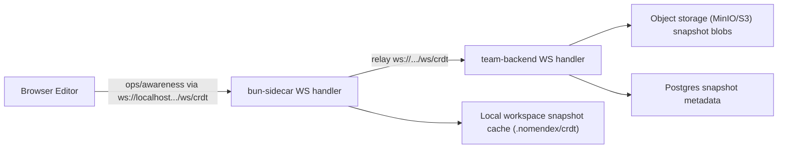
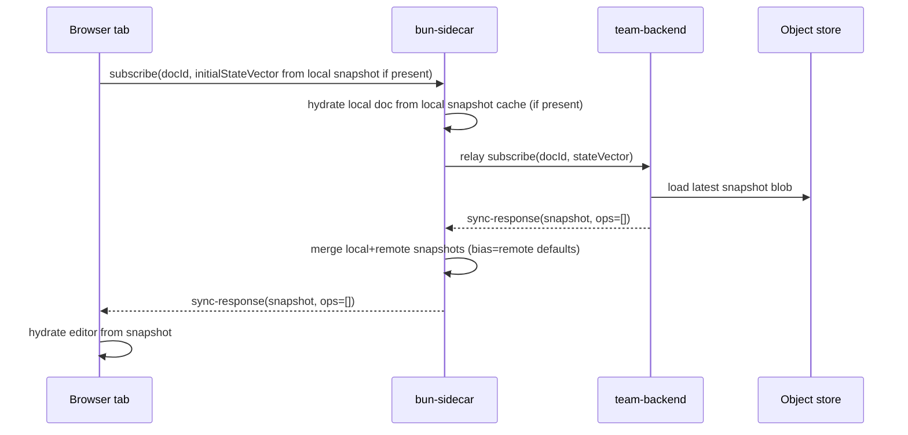
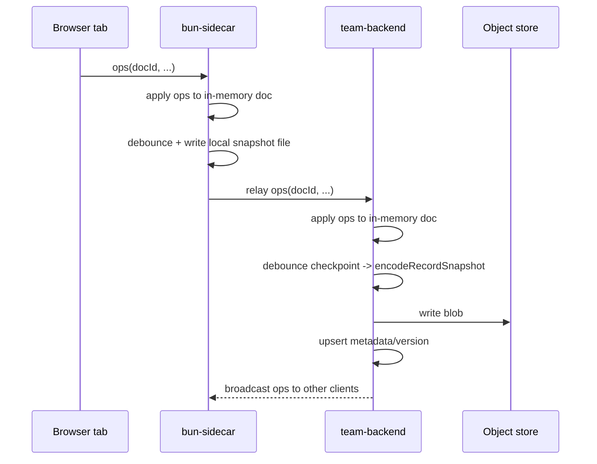

# CRDT Snapshot-Only Persistence Implementation Guide

Date: 2026-02-22  
Status: Draft implementation plan  
Audience: `bun-sidecar`, `team-backend`, and `crdt` maintainers

## 1. Objective

Implement a snapshot-only CRDT persistence model for notes with these explicit outcomes:

1. Every opened note maintains a local CRDT snapshot file in the sidecar workspace.
2. Team backend is the source of truth for shared state across devices.
3. Durable op-log persistence (`CollabOp`) is removed.
4. Team backend snapshot blobs are stored in object storage (MinIO in local dev, S3-compatible in hosted envs).
5. Team mode should use backend relay by default.
6. Offline edits should still be possible and later reconcile when connectivity returns.

This guide is standalone and includes where data lives, required code changes, migration steps, and verification criteria.

---

## 2. Scope and Non-Goals

### In scope

1. Notes CRDT persistence and hydration.
2. Relay behavior between sidecar and team-backend.
3. Snapshot storage and metadata model.
4. Removal of durable op-log persistence.
5. Multi-device verification plan.

### Out of scope

1. Rewriting non-note CRDT domains (kanban/canvas) in this pass.
2. UI redesign work (except minimal controls needed for debugging).
3. Auth model changes beyond existing token usage.

---

## 3. Current State (As-Is)

## 3.1 Sidecar runtime and workspace paths

Current sidecar behavior:

1. Browser connects to local sidecar WS at `/ws/crdt`.
2. Sidecar may relay to team-backend when `CRDT_RELAY_ENABLED=true` and team context is active.
3. Workspace selection persists in global config at:
   `/Users/jacobcolling/Library/Application Support/com.firstloop.nomendex/config.json`
4. Team workspaces cloned from GitHub are created under:
   `/Users/jacobcolling/Library/Application Support/com.firstloop.nomendex/team-workspaces/{orgWorkspaceId}`

Relevant files:

1. `/Users/jacobcolling/nomendex/bun-sidecar/src/server.ts`
2. `/Users/jacobcolling/nomendex/bun-sidecar/src/storage/global-config.ts`
3. `/Users/jacobcolling/nomendex/bun-sidecar/src/storage/root-path.ts`
4. `/Users/jacobcolling/nomendex/bun-sidecar/src/server-routes/workspaces-routes.ts`

### Shell commands with spaces (macOS)

```bash
cd "/Users/jacobcolling/Library/Application Support/com.firstloop.nomendex/team-workspaces"
open "/Users/jacobcolling/Library/Application Support/com.firstloop.nomendex/team-workspaces"
```

## 3.2 Notes editor CRDT flow

Current behavior in notes:

1. Editor loads markdown from disk.
2. Collab plugin captures local ops and sends via `CollabContext`.
3. Remote ops are applied via `applyRemoteOps`.
4. Sync bootstrap is coordinated with `onSyncComplete`, presync op queueing, and localStorage claim.

Relevant files:

1. `/Users/jacobcolling/nomendex/bun-sidecar/src/features/notes/note-view.tsx`
2. `/Users/jacobcolling/nomendex/bun-sidecar/src/contexts/CollabContext.tsx`

## 3.3 Team backend persistence model

Current backend model:

1. Durable ops stored in `collab_ops` (`CollabOp`).
2. Snapshots optionally stored in object storage.
3. Hydration logic loads latest snapshot and then replays ops after `baseSeq`.
4. Checkpointing prunes persisted ops up to `baseSeq`.

Relevant files:

1. `/Users/jacobcolling/nomendex/team-backend/src/collab/persistence.ts`
2. `/Users/jacobcolling/nomendex/team-backend/src/collab/websocket.ts`
3. `/Users/jacobcolling/nomendex/team-backend/src/collab/snapshot-store.ts`
4. `/Users/jacobcolling/nomendex/team-backend/prisma/schema.prisma`

## 3.4 Existing CRDT library capabilities now available

The vendored `nomendex/crdt` package now includes APIs needed for snapshot-centric flow:

1. `mergeRecordSnapshots(...)`
2. `applySnapshotToDoc(...)` with `"replace" | "merge"` hydration modes
3. `getRecordSnapshotVersion(...)` and `isRecordSnapshotVersion(...)`
4. `getRecordSnapshotStateVector(...)`
5. `missingFromRecordSnapshot(...)`

Relevant files:

1. `/Users/jacobcolling/nomendex/crdt/src/crdt/document/snapshot.ts`
2. `/Users/jacobcolling/nomendex/crdt/src/crdt/document/doc-manager.ts`
3. `/Users/jacobcolling/nomendex/crdt/src/crdt/index.ts`

---

## 4. Critical Gaps To Fix Before Snapshot-Only Persistence

These are blockers for correctness and explain current sync path risk.

## 4.1 Snapshot payload handling is incomplete in relay path

`createMultiDocTransport` supports `onSnapshot`, but relay does not pass it through.

Impact:

1. Remote sync responses containing snapshot bytes can be partially ignored.
2. Subscribers may only apply trailing ops, not base snapshot state.
3. This can produce apparent empty docs, duplicate bootstrap, or unstable render behavior.

File:

1. `/Users/jacobcolling/nomendex/crdt/src/crdt/server/relay.ts`

## 4.2 Browser-side transport usage does not currently consume snapshot callbacks

`CollabContext` creates transport with `onOps` and `onAwareness`, but not `onSnapshot`.

Impact:

1. Browser sync can miss base snapshot hydration.
2. Delta-only apply can become invalid if no ops trail exists.

File:

1. `/Users/jacobcolling/nomendex/bun-sidecar/src/contexts/CollabContext.tsx`

## 4.3 Offline-after-restart reconciliation requires snapshot publish path

If durable op-log is removed, a client that edited offline and restarted must still reconcile local snapshot to backend source of truth.  
Current protocol is ops-forward only.

Required protocol enhancement:

1. Add snapshot publish/merge message path (or equivalent server API) so client can send snapshot with version/CAS semantics.

---

## 5. Target Architecture (To-Be)

## 5.1 Data ownership

1. Team backend snapshot for each doc is canonical source of truth.
2. Sidecar snapshot is local cache plus offline continuity layer.
3. Durable op-log table is removed from persistent storage.
4. In-memory transient ops in active WS handlers are allowed as runtime optimization only.

## 5.2 Snapshot-first synchronization model



## 5.3 Open/hydrate sequence



## 5.4 Edit/checkpoint sequence



---

## 6. Storage Layout (Where Everything Lives)

## 6.1 Local sidecar workspace and cache paths

Active workspace root:

1. from `globalConfig.activeWorkspaceId` lookup in:
   `/Users/jacobcolling/Library/Application Support/com.firstloop.nomendex/config.json`

Proposed local CRDT snapshot cache root:

1. `<workspace>/.nomendex/crdt/notes/`

Per-note files:

1. `<workspace>/.nomendex/crdt/notes/{encodeURIComponent(docId)}.bin`
2. `<workspace>/.nomendex/crdt/notes/{encodeURIComponent(docId)}.meta.json`

Meta payload fields:

1. `docId`
2. `snapshotVersion`
3. `updatedAt`
4. `stateVector` (serialized map)
5. `source` (`"local" | "remote-merged"`)
6. `lastKnownBackendVersion` (optional)

## 6.2 Team backend persistent storage

Postgres:

1. `collab_docs` (workspace ownership and latest snapshot metadata pointers)
2. `collab_snapshots` (latest snapshot metadata per doc; no op sequence dependencies)

Object store:

1. key format: `{prefix}/{encodeURIComponent(docId)}/{snapshotId}.bin`
2. prefix from `CRDT_SNAPSHOT_PREFIX` (default `crdt`)
3. bucket from `CRDT_SNAPSHOT_BUCKET`

## 6.3 MinIO local development

Use MinIO as S3-compatible storage for local team-backend dev.

Current compose file to extend:

1. `/Users/jacobcolling/nomendex/team-backend/docker-compose.yml`

Add services:

1. `minio`
2. `createbuckets` (using `minio/mc`) for idempotent bucket provisioning

---

## 7. Detailed Implementation Plan

## Phase 0: Protocol and library prerequisites

### Goal

Ensure snapshot data is actually consumed and can be published/merged without durable oplog.

### Work items

1. Update relay to handle incoming snapshot payloads:
   1. File: `/Users/jacobcolling/nomendex/crdt/src/crdt/server/relay.ts`
   2. Pass `onSnapshot` into transport.
   3. On snapshot: hydrate local relay handler state via `applySnapshotToDoc` (`mode: "replace"` on cold hydrate, `"merge"` when local exists).
2. Expose snapshot callback in sidecar `CollabContext` usage:
   1. File: `/Users/jacobcolling/nomendex/bun-sidecar/src/contexts/CollabContext.tsx`
   2. Consume `onSnapshot` and notify subscribers or hydrate local manager state.
3. Add snapshot publish protocol (required for offline-after-restart if oplog is removed):
   1. Add new WS message type such as `snapshot-publish`.
   2. Payload includes `docId`, `snapshot`, `expectedVersion` (optional), and `mergeBias`.
   3. Server merges with canonical snapshot and replies with authoritative snapshot/version.

### Acceptance criteria

1. A `sync-response` snapshot is always applied in both relay and browser paths.
2. A client with local snapshot but no pending op history can still reconcile to backend without oplog.

## Phase 1: Sidecar local note snapshot cache

### Goal

Persist note CRDT snapshot locally as notes are opened/edited and hydrate from it quickly.

### Work items

1. Add snapshot cache module:
   1. New file: `/Users/jacobcolling/nomendex/bun-sidecar/src/features/notes/crdt-snapshot-cache.ts`
   2. APIs:
      1. `readNoteSnapshot({ docId })`
      2. `writeNoteSnapshot({ docId, bytes, meta })`
      3. `deleteNoteSnapshot({ docId })`
      4. `listNoteSnapshots()` (debug)
2. Add path helper support:
   1. Use existing `getNomendexPath()` in `/Users/jacobcolling/nomendex/bun-sidecar/src/storage/root-path.ts`
   2. Ensure `.nomendex/crdt/notes` exists on startup.
3. Add sidecar server routes:
   1. New route file: `/Users/jacobcolling/nomendex/bun-sidecar/src/server-routes/crdt-routes.ts`
   2. Endpoints:
      1. `/api/crdt/note-snapshot/get`
      2. `/api/crdt/note-snapshot/save`
      3. `/api/crdt/note-snapshot/delete`
4. Update server route registration:
   1. File: `/Users/jacobcolling/nomendex/bun-sidecar/src/server.ts`
5. Hydrate in note editor open flow:
   1. File: `/Users/jacobcolling/nomendex/bun-sidecar/src/features/notes/note-view.tsx`
   2. On open:
      1. Load local snapshot bytes (if present).
      2. Build initial state vector from snapshot via `getRecordSnapshotStateVector`.
      3. Subscribe with that state vector.
   3. On local/remote state changes:
      1. Debounce snapshot writes (for example 1-2s).
      2. Write snapshot bytes and version to local cache.
6. Add safe/atomic local writes:
   1. Write `.tmp` file then rename to avoid partial corruption.

### Acceptance criteria

1. Reopening a note in same workspace can hydrate instantly from local snapshot even before network.
2. Snapshot files are created under `.nomendex/crdt/notes`.
3. No editor crash when local snapshot exists but markdown file has diverged; merge behavior is deterministic.

## Phase 2: Team-backend snapshot-only persistence

### Goal

Remove durable op-log persistence and make snapshot metadata + blob storage the durable state.

### Work items

1. Prisma schema migration:
   1. File: `/Users/jacobcolling/nomendex/team-backend/prisma/schema.prisma`
   2. Remove `CollabOp` model.
   3. Remove `lastSnapshotSeq` and `baseSeq` fields that only exist for op-log replay.
   4. Add snapshot version metadata:
      1. `snapshotVersion` on `CollabDoc` or `CollabSnapshot`.
      2. `stateVectorJson` or equivalent.
   5. Keep one latest snapshot row per doc (enforce unique doc constraint or upsert strategy).
2. Replace persistence adapter functions:
   1. File: `/Users/jacobcolling/nomendex/team-backend/src/collab/persistence.ts`
   2. Remove:
      1. `appendCollabOps`
      2. `loadCollabOps`
      3. `getLatestCollabOpSeq`
   3. Add:
      1. `loadCanonicalSnapshot({ docId, orgWorkspaceId })`
      2. `saveCanonicalSnapshot({ docId, orgWorkspaceId, bytes, expectedVersion? })`
      3. `mergeAndSaveSnapshot({ docId, localBytes, remoteBytes, bias })`
3. Update websocket hydration/checkpoint flow:
   1. File: `/Users/jacobcolling/nomendex/team-backend/src/collab/websocket.ts`
   2. Hydrate only from latest snapshot.
   3. Keep in-memory doc updates from live ops.
   4. Periodically checkpoint full snapshot to storage.
   5. Remove op-table replay logic.
4. Add optimistic CAS on snapshot writes:
   1. Use `getRecordSnapshotVersion`.
   2. Reject stale writes or auto-merge stale writes server-side with `mergeRecordSnapshots`.
5. Keep workspace authorization rules unchanged:
   1. File: `/Users/jacobcolling/nomendex/team-backend/src/collab/doc-id.ts`
   2. File: `/Users/jacobcolling/nomendex/team-backend/src/collab/websocket.ts`

### Acceptance criteria

1. Backend restart with no op-log still resumes full document state from snapshots.
2. Snapshot writes are deterministic and do not regress concurrent edits.
3. `collab_ops` table is no longer written to or read from.

## Phase 3: Team-backend object storage via MinIO (local dev)

### Goal

Provide a local S3-compatible backend for snapshot blobs.

### Work items

1. Extend docker compose:
   1. File: `/Users/jacobcolling/nomendex/team-backend/docker-compose.yml`
   2. Add `minio` and bucket init service.
2. Update environment defaults:
   1. File: `/Users/jacobcolling/nomendex/team-backend/.env.example`
   2. Include MinIO-friendly defaults:
      1. `CRDT_SNAPSHOT_BUCKET=nomendex-crdt`
      2. `CRDT_S3_ENDPOINT=http://localhost:9000`
      3. `CRDT_S3_REGION=us-east-1`
      4. `CRDT_S3_ACCESS_KEY_ID=minioadmin`
      5. `CRDT_S3_SECRET_ACCESS_KEY=minioadmin`
3. Validate Bun S3 client against MinIO:
   1. File: `/Users/jacobcolling/nomendex/team-backend/src/collab/snapshot-store.ts`
   2. Confirm read/write/stat/exists work with endpoint config.

### Example compose additions

```yaml
services:
  minio:
    image: minio/minio:latest
    command: server /data --console-address ":9001"
    environment:
      MINIO_ROOT_USER: minioadmin
      MINIO_ROOT_PASSWORD: minioadmin
    ports:
      - "9000:9000"
      - "9001:9001"
    volumes:
      - minio-data:/data

  createbuckets:
    image: minio/mc:latest
    depends_on:
      - minio
    entrypoint: >
      /bin/sh -c "
      mc alias set local http://minio:9000 minioadmin minioadmin &&
      mc mb -p local/nomendex-crdt || true &&
      mc anonymous set private local/nomendex-crdt || true
      "

volumes:
  minio-data:
```

## Phase 4: Relay default-on behavior in team mode

### Goal

When app mode is team and backend URL is configured, relay should be enabled by default.

### Work items

1. Adjust sidecar relay enable logic:
   1. File: `/Users/jacobcolling/nomendex/bun-sidecar/src/server.ts`
   2. Replace strict env toggle with:
      1. team mode + authenticated token + backend URL => relay on by default
      2. explicit `CRDT_RELAY_ENABLED=false` can still force off for debugging
2. Update docs and env examples:
   1. File: `/Users/jacobcolling/nomendex/bun-sidecar/.env.example`
   2. File: `/Users/jacobcolling/nomendex/bun-sidecar/README.md`

### Acceptance criteria

1. Team workspaces automatically relay without extra manual env setup.
2. Solo mode remains local-only.

## Phase 5: Snapshot conflict and merge policy

### Goal

Define deterministic, testable merge semantics.

### Policy

1. Backend snapshot is canonical, but merge instead of blind overwrite when local unsynced state exists.
2. Default merge bias:
   1. `remote` for safety when remote is canonical.
3. Use library merge for record-level reconciliation:
   1. `mergeRecordSnapshots({ local, remote, bias: "remote" })`
4. Return authoritative merged snapshot to clients.

### Edge-case note

Current snapshot-only merge quality is strong for:

1. LWW fields
2. OR-Set entries
3. deterministic body conflict resolution with bias

It is not yet a full formal causal merge for all mark/attr/reparent races.  
Treat this as acceptable for now, and keep a follow-up hardening issue.

## Phase 6: Observability and guardrails

### Goal

Make snapshot-only behavior debuggable in production and local testing.

### Required logs/metrics

1. Snapshot load events:
   1. docId
   2. source (`local-cache`, `backend`, `merged`)
   3. byte size
   4. version
2. Snapshot save events:
   1. docId
   2. old/new version
   3. CAS hit/miss
   4. write duration
3. Merge events:
   1. docId
   2. bias
   3. local version
   4. remote version
4. Error events:
   1. decode failures
   2. malformed snapshot
   3. auth/workspace mismatch

### Files to update

1. `/Users/jacobcolling/nomendex/bun-sidecar/src/lib/crdt-debug.ts`
2. `/Users/jacobcolling/nomendex/team-backend/src/collab/websocket.ts`
3. `/Users/jacobcolling/nomendex/team-backend/src/collab/persistence.ts`

## Phase 7: Data migration and cutover

### Goal

Transition existing environments without losing current collaborative state.

### Migration sequence

1. Deploy code that can read existing op-log-backed docs and write canonical snapshots.
2. Run one-time backfill job:
   1. For each `collab_doc`, hydrate from current snapshot + ops.
   2. Save single canonical snapshot with version metadata.
3. Verify backfill counts and random sample correctness.
4. Deploy schema migration dropping `collab_ops`.
5. Remove residual op-log read/write code paths.

### Suggested script location

1. `/Users/jacobcolling/nomendex/team-backend/src/scripts/backfill-collab-snapshots.ts`

---

## 8. Required Code Touchpoints (Checklist)

## CRDT library

1. `/Users/jacobcolling/nomendex/crdt/src/crdt/server/relay.ts`
2. `/Users/jacobcolling/nomendex/crdt/src/crdt/network/multi-doc-transport.ts`
3. `/Users/jacobcolling/nomendex/crdt/src/crdt/server/websocket-handler.ts`

## bun-sidecar

1. `/Users/jacobcolling/nomendex/bun-sidecar/src/server.ts`
2. `/Users/jacobcolling/nomendex/bun-sidecar/src/contexts/CollabContext.tsx`
3. `/Users/jacobcolling/nomendex/bun-sidecar/src/features/notes/note-view.tsx`
4. `/Users/jacobcolling/nomendex/bun-sidecar/src/features/notes/crdt-snapshot-cache.ts` (new)
5. `/Users/jacobcolling/nomendex/bun-sidecar/src/server-routes/crdt-routes.ts` (new)
6. `/Users/jacobcolling/nomendex/bun-sidecar/src/server-routes/index wiring in server.ts`
7. `/Users/jacobcolling/nomendex/bun-sidecar/.env.example`
8. `/Users/jacobcolling/nomendex/bun-sidecar/README.md`

## team-backend

1. `/Users/jacobcolling/nomendex/team-backend/prisma/schema.prisma`
2. `/Users/jacobcolling/nomendex/team-backend/prisma/migrations/*` (new migration)
3. `/Users/jacobcolling/nomendex/team-backend/src/collab/persistence.ts`
4. `/Users/jacobcolling/nomendex/team-backend/src/collab/websocket.ts`
5. `/Users/jacobcolling/nomendex/team-backend/src/collab/snapshot-store.ts`
6. `/Users/jacobcolling/nomendex/team-backend/docker-compose.yml`
7. `/Users/jacobcolling/nomendex/team-backend/.env.example`

---

## 9. Testing and Validation Plan

This section aligns to the user-testing policy in repo AGENTS instructions.

## 9.1 Core two-tab editor scenarios (manual, headed)

Use `/collab-test` with distinct query identities:

1. Tab A: `?userId=user-a`
2. Tab B: `?userId=user-b`

For each scenario:

1. Type one key event at a time.
2. Verify convergence both directions.
3. Capture screenshots for Tab A and Tab B.
4. Record pass/fail and mismatch.

Minimum scenarios:

1. plain paragraph typing
2. bullet list via `- `
3. numbered list via `1. `
4. nested list indent/outdent
5. headings
6. bold/italic/code marks
7. blockquotes
8. links and wiki links
9. todo checkbox patterns
10. mixed-content insert/delete in middle of formatted blocks

## 9.2 Snapshot-specific tests

1. Local reopen:
   1. Edit note.
   2. Close tab.
   3. Reopen note with network disabled.
   4. Confirm local snapshot hydration shows latest content.
2. Backend restart durability:
   1. Edit note from Device A.
   2. Restart team-backend.
   3. Open from Device B.
   4. Confirm full state restored from snapshot.
3. CAS merge:
   1. Device A and B diverge offline.
   2. Reconnect both.
   3. Confirm merged canonical snapshot is stable and deterministic.
4. No oplog dependency:
   1. Verify system behavior with `collab_ops` removed.
   2. Confirm no runtime query touches removed table.

## 9.3 Regression checks

1. No duplicate-key warnings from right sidebar TOC list under repeated headings.
2. No crash on initial load when snapshot exists.
3. No CRDT apply errors in browser console/logs.

---

## 10. Rollout Plan

## Stage 1: Internal dev

1. Enable MinIO locally.
2. Enable relay default-on in team mode.
3. Keep temporary feature flags:
   1. `CRDT_SNAPSHOT_ONLY=true`
   2. `CRDT_LOCAL_SNAPSHOT_CACHE=true`

## Stage 2: Dogfood multi-device

1. Test across at least two physical devices.
2. Track merge/CAS metrics and snapshot load failures.
3. Fix regressions before removing fallback flags.

## Stage 3: Production cutover

1. Backfill canonical snapshots.
2. Deploy migration removing `CollabOp`.
3. Remove old oplog code paths.
4. Keep emergency fallback flag for one release cycle.

---

## 11. Risks and Mitigations

1. Risk: snapshot publish protocol missing causes offline-after-restart data loss.
   1. Mitigation: implement snapshot publish/CAS before dropping oplog.
2. Risk: merge semantics for complex mark/attr/reparent races are not fully formal.
   1. Mitigation: preserve merge bias defaults, add targeted regression tests, log conflict events.
3. Risk: large snapshots increase latency.
   1. Mitigation: debounce writes, optionally gzip/compress blobs, track byte sizes.
4. Risk: local snapshot corruption.
   1. Mitigation: atomic write + checksum/version verification before hydrate.
5. Risk: relay disabled unexpectedly in team mode.
   1. Mitigation: default-on logic + explicit warning log when disabled.

---

## 12. Definition of Done

All items below must be true:

1. Notes CRDT state hydrates from local snapshot on open.
2. Team-backend is canonical snapshot source across devices.
3. Durable op-log persistence is removed (schema + code path).
4. MinIO-backed local dev storage works via Bun S3 client.
5. Team mode relay is default-on and verified.
6. Manual two-tab and multi-device test matrix passes with screenshots and logs.
7. No editor runtime crashes and no CRDT apply failures in tested scenarios.

---

## 13. Quick Runbook Commands

## Local infra

```bash
cd /Users/jacobcolling/nomendex/team-backend
docker compose up -d
bun run db:migrate
bun run dev
```

## Sidecar

```bash
cd /Users/jacobcolling/nomendex/bun-sidecar
bun dev
```

## Inspect active team workspace folder

```bash
cd "/Users/jacobcolling/Library/Application Support/com.firstloop.nomendex/team-workspaces"
ls -la
```

## Inspect local CRDT cache in workspace

```bash
cd "/Users/jacobcolling/Library/Application Support/com.firstloop.nomendex/team-workspaces/<orgWorkspaceId>/.nomendex/crdt/notes"
ls -la
```

---

## 14. Notes for CRDT Library Team

If additional CRDT package changes are needed, prioritize:

1. Relay-level snapshot application (`onSnapshot`) support.
2. Snapshot publish protocol with CAS/version.
3. Stable snapshot merge semantics documentation for advanced body conflicts.

This enables a strict snapshot-only durability model without reintroducing a persistent op-log.

