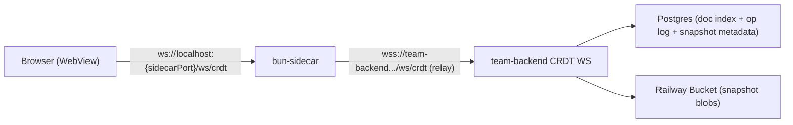

# Phase 3 Plan: Team Backend Relay + Durable CRDT State

> Date: 2026-02-19
> Scope: Team mode only (`teamMode === "team"`)
> Snapshot storage decision: Railway object storage bucket via Bun S3 client

## Goal

Complete Phase 3 so CRDT sync works across machines using a single hosted `team-backend`, with durable resume after backend restarts.

## Implementation Status (2026-02-19)

- Done: team-backend `/ws/crdt` with auth, workspace authorization, DB op persistence, S3 snapshot hydrate/checkpoint.
- Done: sidecar relay wiring via `createCRDTRelay` behind `CRDT_RELAY_ENABLED`.
- Done: workspace-scoped CRDT doc IDs for notes + kanban board + kanban cards.
- Done: team-backend URLs are runtime-configurable in sidecar UI (no hardcoded localhost in team-mode UI paths).
- Remaining before rollout:
  - deploy/verify Railway service envs in production
  - run cross-machine user acceptance scenarios

## Decision Summary

1. Run one shared `team-backend` service for all team workspaces (reasonable for current low usage).
2. Keep browser-to-sidecar local WS path; add sidecar-to-team-backend CRDT relay for remote sync.
3. Persist CRDT snapshots to Railway buckets using Bun's S3 client (`new Bun.S3Client(...)`).
4. Persist snapshot metadata and post-snapshot op log in PostgreSQL for replay and indexing.
5. Keep solo mode unchanged.
6. Keep file-backed notes/todos persistence during this phase (CRDT durability is additive, not a replacement yet).

## Current State (Before Phase 3)

1. CRDT sync is local to each sidecar process (`/ws/crdt` in `bun-sidecar/src/server.ts`).
2. Sidecar restart drops in-memory CRDT state.
3. Team backend has auth/org/workspace APIs but no CRDT WS route.
4. Team backend URLs are now provided by sidecar runtime config (`/api/team-backend/config`).
5. Notes/todos still persist to plain files (good for compatibility, but not multi-machine by themselves).

## Target Architecture

## Data Model and Namespacing

### Doc ID rules (required for multi-tenant safety)

All team-mode CRDT doc IDs must include workspace scope:

1. Notes: `ws:{orgWorkspaceId}:note:{noteFileName}`
2. Board layout: `ws:{orgWorkspaceId}:kanban:{projectKey}`
3. Card record: `ws:{orgWorkspaceId}:card:{todoId}`

This avoids cross-workspace collisions in a single shared backend.

### Persistence schema (team-backend / Prisma)

Add tables for:

1. `CollabDoc`: canonical doc identity and workspace ownership
2. `CollabOp`: append-only op log after last snapshot
3. `CollabSnapshot`: snapshot metadata + storage key + integrity fields

Suggested minimum fields:

1. `CollabDoc`: `id`, `orgWorkspaceId`, `docId`, `lastSnapshotSeq`, `updatedAt`
2. `CollabOp`: `seq` (monotonic), `docId`, `opJson`, `clientId`, `clock`, `createdAt`
3. `CollabSnapshot`: `id`, `docId`, `bucketKey`, `byteSize`, `etag`, `baseSeq`, `createdAt`

## Snapshot and Resume Design

### Write path

1. On incoming CRDT ops: apply to handler state, broadcast, and append ops to `CollabOp`.
2. Mark doc dirty for checkpoint.
3. Trigger checkpoint when either:
   - op count threshold reached (for example 500 ops), or
   - age threshold reached (for example 60s since last checkpoint), or
   - graceful shutdown hook runs.
4. Checkpoint flow:
   - build `encodeRecordSnapshot({ record })`
   - upload bytes to Railway bucket via Bun S3 client
   - insert `CollabSnapshot` row
   - update `CollabDoc.lastSnapshotSeq`
   - prune `CollabOp` rows up to snapshot base sequence

### Resume path

1. First subscribe for a doc on a cold backend:
   - read `CollabDoc`/latest `CollabSnapshot`
   - fetch snapshot blob from bucket
   - `decodeRecordSnapshot` into doc manager
   - load `CollabOp` rows with `seq > lastSnapshotSeq`
   - append/replay those ops into handler
2. Continue normal sync; clients still receive snapshot + trailing ops via current protocol.

## Implementation Work Breakdown

### 1) Team-backend CRDT service

1. Add `/ws/crdt` route and wire `createCRDTWebSocketHandler`.
2. Authenticate WS using Clerk JWT from query token (same trust model as existing APIs).
3. Authorize doc access by mapping doc prefix workspace ID to org membership.
4. Implement persistence adapter (Postgres + S3) for op append, checkpoint, and hydrate.

### 2) Sidecar relay and doc routing

1. Replace pure local handler in team mode with `createCRDTRelay` targeting team-backend.
2. Dynamically relay docs based on local subscribe/unsubscribe activity.
3. Keep local-only fallback for dev/offline and non-team mode.

### 3) Doc ID migration and compatibility

1. Introduce shared doc-id builder helpers for notes and todos.
2. Migrate note IDs from `note:{fileName}` to workspace-scoped IDs.
3. Migrate kanban card doc IDs to workspace-scoped IDs.
4. Include one-time compatibility read for legacy IDs during transition.

### 4) Production config and deployment

#### Sidecar/runtime config

1. `TEAM_BACKEND_HTTP_URL` (REST API base)
2. `TEAM_BACKEND_WS_URL` (CRDT relay target)
3. `CRDT_RELAY_ENABLED` (`true` in team mode prod)

#### Team-backend config

1. Existing: `DATABASE_URL`, Clerk keys, GitHub app keys, `PORT`
2. New snapshot env vars:
   - `CRDT_SNAPSHOT_BUCKET`
   - `CRDT_SNAPSHOT_PREFIX` (default `crdt/`)
   - `CRDT_S3_ENDPOINT`
   - `CRDT_S3_REGION`
   - `CRDT_S3_ACCESS_KEY_ID`
   - `CRDT_S3_SECRET_ACCESS_KEY`
   - `CRDT_CHECKPOINT_OP_THRESHOLD`
   - `CRDT_CHECKPOINT_MAX_AGE_MS`

#### Railway rollout

1. Deploy one `team-backend` service + Postgres + Railway bucket.
2. Run Prisma migration for collab tables.
3. Configure env vars in Railway service.
4. Ship sidecar build with production backend URLs.
5. Enable relay by feature flag for internal team first, then full rollout.

## Testing and Acceptance

### Functional

1. Two different machines, same team workspace, same note: edits converge both directions.
2. Same test for kanban board + card updates + presence.
3. Solo workspace behavior unchanged.

Execution checklist:
- `docs/specs/team/phase-3-user-testing-checklist.md`

### Durability

1. Edit doc, force backend restart, reconnect: state resumes correctly.
2. Edit doc after snapshot + additional ops: reconnect returns snapshot + tail ops.

### Security and tenancy

1. User not in workspace cannot subscribe to that workspace doc IDs.
2. Cross-workspace doc IDs cannot be read by unauthorized users.

## Definition of Done (Phase 3)

1. Team-mode CRDT sync works across machines via hosted team-backend.
2. Backend restart does not lose team CRDT state.
3. Snapshot blobs are stored in Railway bucket through Bun S3 client.
4. Sidecar/backend URLs are production-configurable (no hardcoded localhost in team flows).
5. Rollout can be toggled with feature flag and has fallback path.

## Risks and Mitigations

1. Doc ID migration collisions:
   - Mitigation: strict namespaced builder and legacy read-only bridge during cutover.
2. Checkpoint backlog growth:
   - Mitigation: dirty-doc queue + bounded worker concurrency + metrics.
3. Query-token WS auth leakage:
   - Mitigation: always WSS in production, short token TTL, no token logging.
